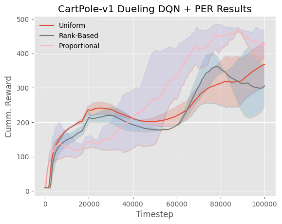

# Implementation of PER and Dueling DQN 
----------------
This repo implements Dueling DQN architecture and Prioritized Experience Replay. Both versions of the PER are implemented (rank-based and proportional). To run the repo install `uv` and then run `uv sync`. Then run this command to run an experiment. 

```bash
python3 src/dueling_dqn/main.py [ARGS]
```

---------
### Implementations of Prioritized Experience Replay


For the Proportinal PER I use a sum-tree structure as mentioned in the paper. 

For the Rank-Based PER I used a different (somewhat-original) implementation based on `SortedList` from `sortedcontainers`. The data structure is essentially a dictionary but is ranked based on the value (absolute TD-error). This is done by sorting the errors using the `SortedList` and bookeeping the respective indices (for the samples stored in the buffer). The runtime (based on the `sortedcontainers` docs) is O(log(n)) for updating and retrieving and we don't run into the problem that of unbalanced arrays, as in the original paper.   

--------------------
### Results 

| Game | Learning Curve   |
:------------------:| :-------------------------:
**CartPole-v1** |  | 

The proportional variant seems to do well in comparison with the others. Rank-based and Uniform perform similarly. Cartpole is quite simple so the benefits of PER are not as evident. There is still some stochasticity in the results and the model is quite depedent on hyperparameters. 


-------
### Some Problems 


- Learning in more complex environments is quite unstable. I suspect this is due to unoptimized hyperparameters. The loss tends to increase to large values, so it could also be a problem with training procedure. 
- The Atari code is quite computationally expensive, so I was unable to train a model on ALE. The code is still present. 

-------------
### References

[1] Wang, Z., Schaul, T., Hessel, M., van Hasselt, H., Lanctot, M., & de Freitas, N. (2016). Dueling network architectures for deep reinforcement learning. arXiv. https://doi.org/10.48550/arXiv.1511.06581

[2] Schaul, T., Quan, J., Antonoglou, I., & Silver, D. (2016). Prioritized experience replay. arXiv. https://doi.org/10.48550/arXiv.1511.05952